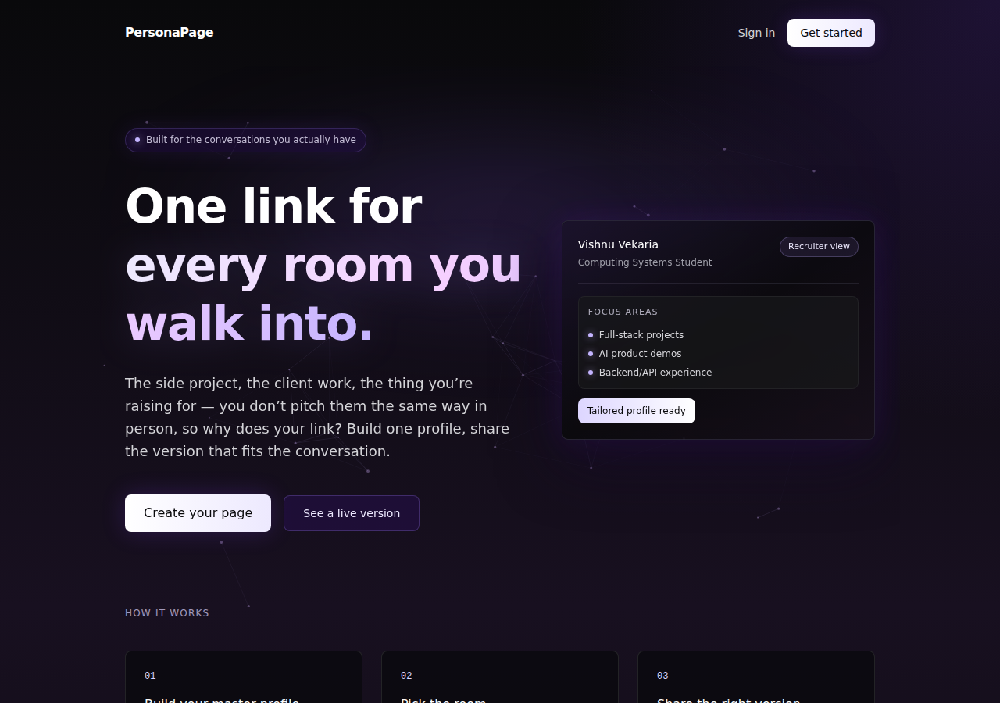
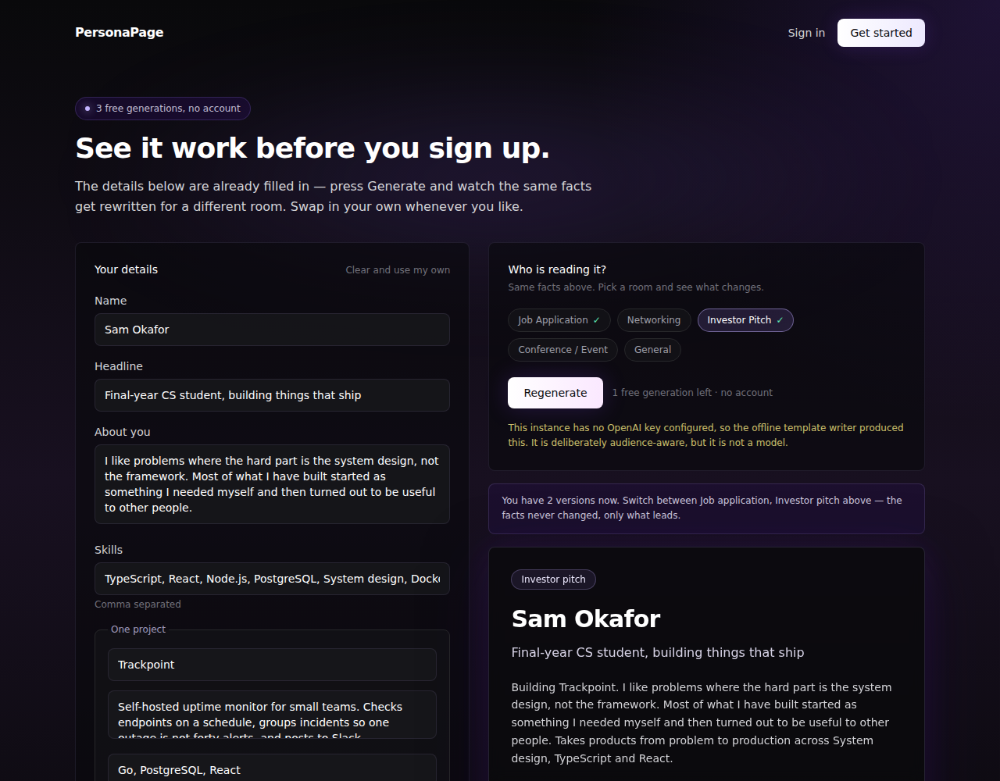

# PersonaPage

**One profile. A different version of it for every room you walk into.**

You don't pitch your side project to a recruiter the way you pitch it to a
co-founder. PersonaPage keeps one master profile and generates a tailored public
page per audience — so the link you hand someone is written for the conversation
you're actually having.

**Live → [personapage-app.vercel.app](https://personapage-app.vercel.app)** · **[Try it with no account](https://personapage-app.vercel.app/try)**



## Try it without signing up

Nobody types their bio into a signup form to find out whether a product is any
good, so `/try` works with no account: three free generations, prefilled so the
first one is a single click.

Generate once, switch audience, generate again — the two sit side by side and
the facts never changed, only what leads.



Nothing is written to the database on that path. The draft goes up in the
request, the content comes back in the response, and that's the whole lifecycle,
so a visitor leaves no rows behind and hands over no personal data before
deciding to sign up. What they typed carries into signup and lands on their
profile, so making an account saves work rather than asking for it twice.

---

## How it works

1. **Fill in one profile.** Name, headline, bio, skills, projects, tone. This is
   the only place you maintain anything.
2. **Create a link per audience — or per opportunity.** Pick an audience, or aim
   the link at one company and paste their job posting. With a posting, your
   facts get reordered to lead with what it actually asks for.
3. **Generate.** Each context has its own prompt configuration — a different
   audience, a different thing to lead with, a different call to action — so the
   output is genuinely different, not just reworded. Then edit it by hand if you
   want; what you save is exactly what visitors see.
4. **Share it.** Every view is counted per link, so you can see which version of
   you people actually open.

The generator is grounded: it is told never to invent metrics, companies, or
technologies, and any skill the model returns that you didn't claim is stripped
out server-side before it is saved.

---

## Running it

You need Node 22+ and a Supabase project. An OpenAI key is **optional** —
without one, generation falls back to a deterministic template writer and every
feature still works.

```bash
git clone https://github.com/V-Vekaria/personapage.git
cd personapage
npm install
cp .env.example .env.local     # then fill in your Supabase keys
```

Create the schema — run everything in `supabase/migrations/` against your
project, in order, either with `supabase db push` or by pasting each file into
the Supabase SQL editor:

```
0001_init.sql                profiles, links, link_views, and the RLS policies
0002_link_targets.sql        who a link is aimed at, and the posting behind it
0003_link_clicks.sql         outbound contact clicks
0004_restrict_public_reads.sql  removes the anon role's read access
0005_link_dwell.sql          how long each view actually lasted
```

All five are idempotent, so re-running them on a database that already has data
is safe. `0004` is a security fix and tightens access — run it.

```bash
npm run dev                    # http://localhost:3000
```

Sign up at `/signup`, and you have a working profile. To skip the typing, point
`supabase/seed.sql` at the email you signed up with and run it — that fills in a
complete profile and one link per audience.

### Environment variables

| Variable | Required | What it does |
|---|---|---|
| `NEXT_PUBLIC_SUPABASE_URL` | yes | Supabase project URL |
| `NEXT_PUBLIC_SUPABASE_ANON_KEY` | yes | Browser-safe key; every query it makes is gated by RLS |
| `SUPABASE_SERVICE_ROLE_KEY` | yes | Server-only, and load-bearing: it is the *only* way public profile pages are read, since no policy grants the anon role access |
| `OPENAI_API_KEY` | no | Without it, the offline template writer is used |
| `OPENAI_MODEL` | no | Defaults to `gpt-4.1` |
| `NEXT_PUBLIC_SITE_URL` | no | Canonical origin for social cards; inferred on Vercel |

### Scripts

```bash
npm run dev         # development server
npm run build       # production build
npm run typecheck   # tsc --noEmit
npm run lint        # eslint
npm test            # vitest
```

---

## Architecture

```
app/
  (auth)/           login + signup, server actions, zod-validated
  (dashboard)/      dashboard, profile, links, analytics — all auth-gated
  api/
    ai/generate     generates and saves tailored content for one link
    ai/try          anonymous generation — validates, rate limits, persists nothing
    analytics/view  records a page view after verifying the link exists
    analytics/click records an outbound contact click — the conversion event
    analytics/dwell records how long one view lasted, attached to that view
  p/[username]/     the public profile page + its dynamic OG image
  try/              the no-account demo
components/
  analytics/        chart and stat components
  dashboard/        sidebar and mobile navigation
  public/           view capture and the click-tracked contact button
  ui/               shared status banner, copy button
lib/
  ai/               prompt builder, per-context config, job-posting targeting,
                    offline fallback
  supabase/         browser, server and service-role clients
  analytics.ts      pure aggregation over raw view and click rows
  dwell.ts          read-time cap, formatting, and the visible-time timer
  supabase/columns.ts  the tested allowlist for the public read path
  validation.ts     zod schemas shared by routes and server actions
supabase/
  migrations/       the schema, with RLS policies
  seed.sql          demo data
tests/              vitest unit tests
types/database.ts   shapes mirroring the schema
```

**Next.js 15 App Router, TypeScript (strict), Tailwind v4, Supabase/Postgres,
OpenAI, deployed on Vercel.**

### A few decisions worth explaining

**Row level security does the access control, not the app code.** Every policy
is scoped to `auth.uid()` — the anon role can read nothing at all. That is
deliberate: every anonymous read path in this app goes through the service-role
client, which bypasses RLS anyway, so a public read policy would have granted
access nothing needed while the anon key sits inlined in the deployed bundle.
An earlier version of this schema did exactly that, and it leaked every user's
link labels and slugs to anyone who read the key out of the JavaScript; see
`supabase/migrations/0004_restrict_public_reads.sql`.

**The public path's select list is the security boundary, so it is a tested
constant.** With RLS bypassed by the service role, the columns named in the
query are the only thing between a table and a visitor. They live in
`lib/supabase/columns.ts` and `tests/public-columns.test.ts` asserts that they
exclude owner-only fields and that neither public file ever reaches for
`select('*')` or touches `link_targets`.

**A pasted job posting lives in its own table, not on the link.** `links` is
public by design; a posting is not — it can carry a recruiter's name, an
unlisted role, or internal salary bands. `link_targets` has owner-only policies
and no public policy at all, so leaking it would take a deliberate change rather
than a careless `select('*')`. The public read paths name their columns
explicitly for the same reason.

**The posting steers emphasis, never claims.** It reaches the model fenced and
labelled as data, with instructions to ignore anything inside it that reads like
a command. That is the first line of defence; the ones that actually hold are
the constrained output schema and the filter that drops any skill the user never
claimed. If a posting demands Kubernetes and the profile has never mentioned it,
nothing downstream can put it on the page.

**Views and clicks are written server-side, after the link is verified.** Each
endpoint takes a UUID, confirms the link exists, and only then inserts.
Anonymous clients have no insert policy on `link_views` or `link_clicks` at all,
so nobody can inflate someone's counter by POSTing at the API.

**Analytics stores no IP address and no user agent.** A country code from the
edge and a desktop/mobile bucket is the entire payload, for clicks as well as
views. A profile page shouldn't become a tracker — which is also why "opened on
3 separate days" is derived from timestamps already stored rather than from a
per-visitor identifier.

**Read time counts only visible time, and is capped.** A tab left open in the
background overnight would otherwise report eight hours, so hidden time is
excluded rather than merely clipped. The number still comes from the visitor's
browser, so it is bounded at thirty minutes in the endpoint and again by a
`CHECK` constraint — one crafted request cannot claim a view lasted a year and
poison the median. It attaches to a view that already exists, which is what
stops anyone writing read times for links that do not.

**Clicks are recorded with `sendBeacon`.** The browser is navigating away at
that exact moment and an ordinary request can be cancelled mid-flight; a beacon
is queued and delivered regardless, without delaying the navigation. Losing the
conversion event is worse than losing a view.

**Generation is rate limited per user.** Twenty an hour. It's a fixed window held
in memory, which on serverless counts per instance — enough to stop someone
holding down the button and running up a bill, and documented as not being more
than that.

**The anonymous trial has two limits doing two different jobs.** A signed
httpOnly cookie holds the count the UI shows; it's HMAC-signed so it can't be
casually edited, but a rejected cookie is indistinguishable from a first visit,
so clearing cookies resets the trial. That's accepted, and asserted in a test
rather than left as a surprise. The per-IP rate limit is what actually bounds
cost. Every input field on that endpoint is hard-capped — without caps it would
be a free LLM proxy for anyone willing to paste a few thousand words into a
"bio" field.

**The offline fallback is a real feature, not a stub.** It reorders skills per
audience, changes sentence order and call to action per context, and is
deterministic — which also makes the whole generation path testable without
mocking an API.

**Tailored links are `noindex`.** A link written for one investor conversation
has no business in a search index. The default profile page is indexable.

---

## Tests

197 unit tests over the parts where being wrong is silent: analytics bucketing
and week-over-week maths, click-through rates and the divide-by-zero an
unopened link gives, slug generation, contact-link parsing, the offline
generator, the prompt builder, validation schemas, the rate limiter, the signed
trial cookie (including that a forged one is rejected), and job-posting skill
matching — where two regressions found by actually running it are now pinned:
a skill ending a sentence, and a two-word skill wrapped across a line break. The
public-path column allowlist is asserted too, and both of its guards were
checked by deliberately reintroducing the regressions they exist to catch.

Read time is covered the same way. The visible-time bookkeeping is a plain class
with `now` passed in rather than closures inside a React effect, so "an hour in
a background tab adds nothing" and "the system clock stepping backwards does not
shorten the total" are assertions instead of hopes. The endpoint is exercised
with a stubbed client over a real `text/plain` beacon body. Both guards were
checked by reintroducing the bugs they exist to catch: counting hidden time
fails three tests, and letting the last beacon win instead of the longest fails
one.

Driving it in a real browser then found what reading it had not: navigating away
fires `visibilitychange` and `pagehide` about a millisecond apart, so every
single visit was sending two beacons and doing two database writes. Reports now
need a further whole second of reading before speaking again, which is pinned by
a test.

```bash
npm test
```

CI runs typecheck, lint, tests and a production build on every push and pull
request.

---

## Status and direction

Working today: a no-account demo, auth, profile editor, per-audience and
per-opportunity link generation (paste a job posting) with manual editing,
public profile pages with social cards, and per-link analytics labelled by
recipient — views, outbound contact clicks, click-through rate, how long after
sending a link was first opened, and how long it was actually read for.

**[PRODUCT.md](PRODUCT.md)** is the honest version of where this goes — who
actually has this problem, what Linktree and Teal and DocSend already do, why
the five audience categories are too coarse, and why the tracking is probably
worth more than the AI writing. It includes a candid read on viability, since
"finish it because it demonstrates something" is a legitimate reason that does
not need dressing up as a startup.

Nearest concrete work:

- Notify on first open — the retention loop, and the reason to log back in.
  Needs an email provider configured, so it is the first item here that is not
  purely a code change
- Time on page, not just that the page was opened
- Move the rate limiter into Postgres so it holds across instances

---

## License

MIT — see [LICENSE](LICENSE).
